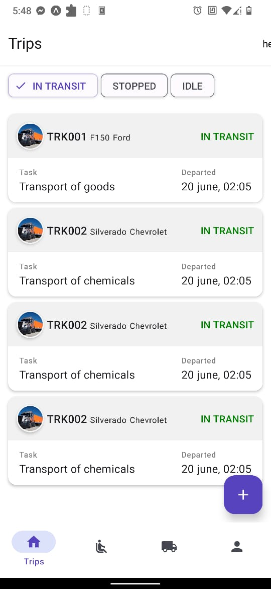
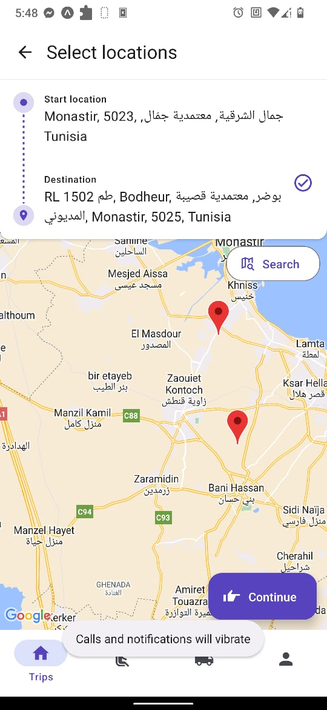
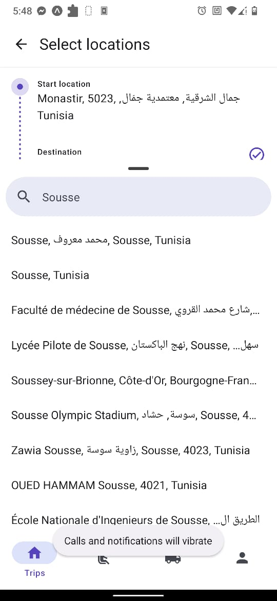
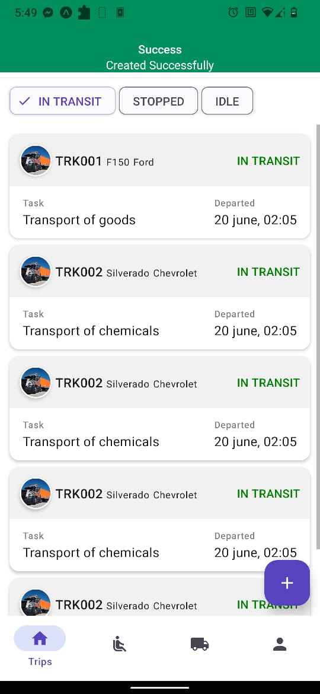
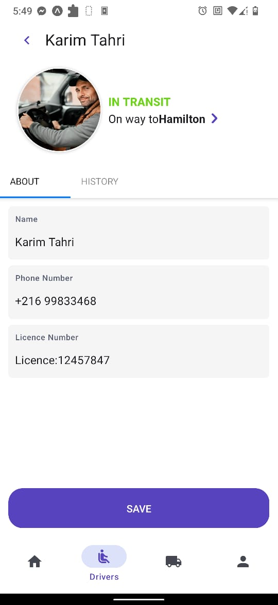

# Description
A mobile app for fleet and logistics management
 &nbsp;            |   &nbsp;
:-------------------------:|:-------------------------:
  |  

 &nbsp;            |   &nbsp;
:-------------------------:|:-------------------------:
  |  

## 🔋 Features
* Users can create vehicles 

* Users can create drivers

* Users can view drivers and vehicles (fleet)

* Users can create a trip
 
    * Users can select start location and destination from a map

    * Users can search for a location

* Users can view trips

## ⚙️ Tech Stack

### Frontend

* TypeScript
* React native
* Expo
* React native paper
* Redux toolkit
* React form hook

### Backend

* Java
* Spring boot
* Spring data jpa
* postgresql

